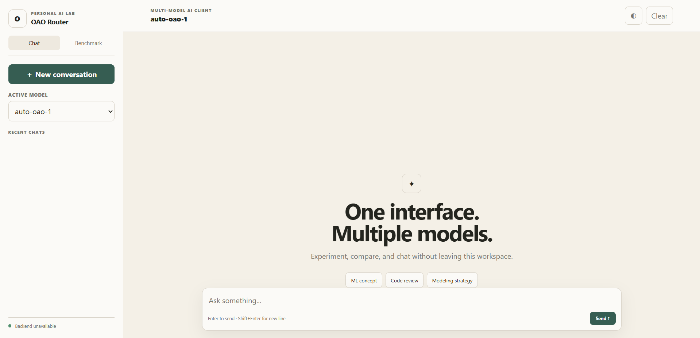

# Multi-Model AI Router & Benchmark Client

<p align="center">
  
</p>

<p align="center">
  <strong>A local AI workspace for experimenting with multiple LLMs through an OpenAI-compatible API gateway.</strong>
</p>

<p align="center">
  <code>Python</code> · <code>Flask</code> · <code>JavaScript</code> · <code>REST API</code> · <code>LLM Integration</code>
</p>

---

## Overview

**Multi-Model AI Router** is a full-stack local AI client built as a practical exploration of LLM API integration.

The application provides one interface for selecting and testing multiple models exposed through an OpenAI-compatible API gateway. It also includes streaming chat, browser-based conversation history, Markdown/code rendering, and a lightweight benchmark mode.

This project focuses on the engineering around LLMs:

**frontend → backend → API gateway → model → response**

rather than trying to reproduce a hosted AI product.

---

## Why I built this

Working with several LLMs can mean switching between different interfaces, SDKs, credentials, and API configurations.

I wanted a small system where I could:

- switch models from one UI
- keep the API credential outside the browser
- experiment with streaming responses
- compare response latency
- inspect how a multi-model client is structured

The result is a compact full-stack AI experiment that is easy to run locally and easy to extend.

---

## Features

### Chat workspace

- Multi-model selector
- Streaming responses
- Markdown rendering
- Syntax-highlighted code blocks
- Copy-code button
- New conversation
- Local conversation history
- Light/dark theme
- Responsive layout

### Benchmark workspace

- Select multiple models
- Send the same prompt to each selected model
- Record request latency
- Capture token usage when returned by the provider
- Compare outputs qualitatively
- Record failed requests separately

---

## Architecture

```text
┌───────────────────────────────┐
│           Browser             │
│      HTML + CSS + JS          │
└───────────────┬───────────────┘
                │
                │ HTTP
                ▼
┌───────────────────────────────┐
│        Flask Backend          │
│                               │
│  /api/models                  │
│  /api/health                  │
│  /api/chat                    │
│  /api/chat/stream             │
│  /api/benchmark               │
└───────────────┬───────────────┘
                │
                │ OpenAI-compatible API
                ▼
┌───────────────────────────────┐
│      Third-party Gateway      │
│              /v1              │
└───────────────┬───────────────┘
                │
       ┌────────┼────────┬────────┐
       ▼        ▼        ▼        ▼
    Model A  Model B  Model C   ...
```

Detailed documentation:

- [`docs/architecture.md`](docs/architecture.md)
- [`docs/api.md`](docs/api.md)
- [`docs/benchmark.md`](docs/benchmark.md)
- [`docs/setup-windows.md`](docs/setup-windows.md)

---

## Tech Stack

| Layer | Technology |
|---|---|
| Frontend | HTML, CSS, Vanilla JavaScript |
| Backend | Python, Flask |
| API client | OpenAI Python SDK |
| Integration | OpenAI-compatible REST API |
| Streaming | HTTP event-stream handling |
| State | Browser `localStorage` |
| Markdown | marked |
| Sanitization | DOMPurify |
| Code highlighting | highlight.js |
| Configuration | `.env` via python-dotenv |

---

## Project Structure

```text
oao-ai-router/
│
├── app.py
├── requirements.txt
├── .env.example
├── .gitignore
├── run_windows.bat
├── README.md
│
├── frontend/
│   ├── index.html
│   ├── style.css
│   └── app.js
│
├── portfolio/
│   ├── case-study.md
│   ├── project-snippet.md
│   └── architecture.mmd
│
└── docs/
    ├── architecture.md
    ├── api.md
    ├── benchmark.md
    ├── setup-windows.md
    └── screenshots/
        └── chat-interface.png
```

---

## Run locally on Windows

### Requirements

- Windows 10/11
- Python 3.10+
- Git
- VS Code recommended

### 1. Clone

```powershell
git clone https://github.com/robbirizaldi/oao-ai-router.git
cd oao-ai-router
```

### 2. Create virtual environment

```powershell
py -m venv .venv
```

### 3. Install dependencies

```powershell
.\.venv\Scripts\python.exe -m pip install -r requirements.txt
```

### 4. Configure environment

Copy:

```text
.env.example
```

to:

```text
.env
```

Then set:

```env
OAO_API_KEY=YOUR_NEW_API_KEY
OAO_BASE_URL=https://oao.clipora.buzz/v1
```

### 5. Start

```powershell
.\.venv\Scripts\python.exe app.py
```

Open:

```text
http://127.0.0.1:5000
```

### Windows shortcut

You can also run:

```text
run_windows.bat
```

---

## Security

The API key is deliberately kept on the Flask backend.

```text
Browser
   │
   ▼
Flask
   │
   └── .env → API key
```

Do **not** put the real API key into:

- `frontend/app.js`
- `index.html`
- README
- screenshots
- GitHub Issues
- public documentation

`.gitignore` excludes `.env` and `.venv/`.

### Important

Any credential that has previously appeared in a public screenshot, chat, commit, or repository should be considered compromised and regenerated.

---

## API

### `GET /api/health`

Checks local backend readiness.

### `GET /api/models`

Returns the model list used by the interface.

### `POST /api/chat`

Example:

```json
{
  "model": "auto-oao-1",
  "messages": [
    {
      "role": "user",
      "content": "Explain the bias-variance trade-off."
    }
  ]
}
```

### `POST /api/chat/stream`

Streams incremental assistant output to the frontend when supported by the upstream provider.

### `POST /api/benchmark`

Runs the same prompt against selected models and returns per-model results.

Full API notes: [`docs/api.md`](docs/api.md)

---

## Benchmarking approach

The benchmark feature measures practical request performance.

For each model:

1. start a timer
2. send the same prompt
3. wait for completion
4. record elapsed time
5. capture usage metadata when available
6. store the response

Example:

| Model | Latency | Tokens | Status |
|---|---:|---:|---|
| Model A | 1.8 s | 820 | Success |
| Model B | 2.4 s | 760 | Success |
| Model C | 4.1 s | — | Failed |

> This is a lightweight functional benchmark, not a scientific LLM ranking system.

Latency can vary because of network conditions, provider load, queueing, output length, rate limits, and gateway behavior.

For rigorous evaluation, repeated runs, fixed datasets, controlled prompts, percentile statistics, and task-specific quality metrics should be used.

See [`docs/benchmark.md`](docs/benchmark.md).

---

## Engineering decisions

### Why Flask?

The backend is intentionally small. Flask provides the REST layer without introducing framework complexity that is unrelated to the purpose of this experiment.

### Why vanilla JavaScript?

The UI does not require a large frontend framework. Vanilla JavaScript keeps the request lifecycle and application state straightforward to inspect.

### Why a backend at all?

An API key embedded in browser JavaScript is not secret. The Flask layer creates the security boundary between browser UI and upstream API credentials.

---

## Limitations

This project depends on a third-party API gateway. Its model availability, naming, rate limits, response format, reliability, and pricing/access policy may change independently of this repository.

For that reason, this project should be understood as an **LLM API integration and routing experiment**, not as a claim that every listed model is an official endpoint of the model vendor named by the gateway.

---

## Future development

Possible extensions:

- SQLite/PostgreSQL conversation persistence
- user authentication
- custom system prompts
- document upload
- RAG pipeline
- automatic task-based model routing
- structured evaluation datasets
- repeated benchmark runs
- median/P95 latency
- cost tracking
- Docker deployment
- production WSGI deployment

---

## Portfolio positioning

### One-line

> Built a full-stack multi-model AI client with Flask and vanilla JavaScript for LLM routing, streaming chat, conversation management, and cross-model performance benchmarking.

### Technical focus

`Python` · `Flask` · `REST API` · `JavaScript` · `LLM Integration` · `API Security` · `Benchmarking`

### Project type

**AI Engineering / API Integration / LLM Experimentation**

---

## Author

**Robbi Rizaldi**

Portfolio: https://robbirizaldi.my.id/

GitHub: https://github.com/robbirizaldi/
